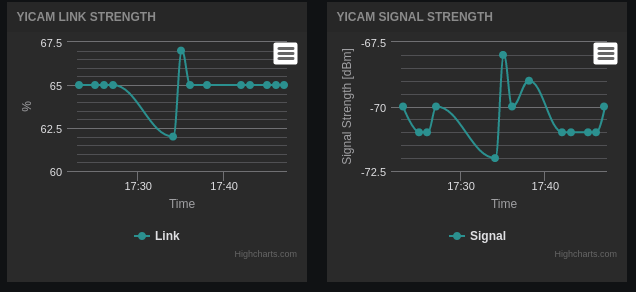
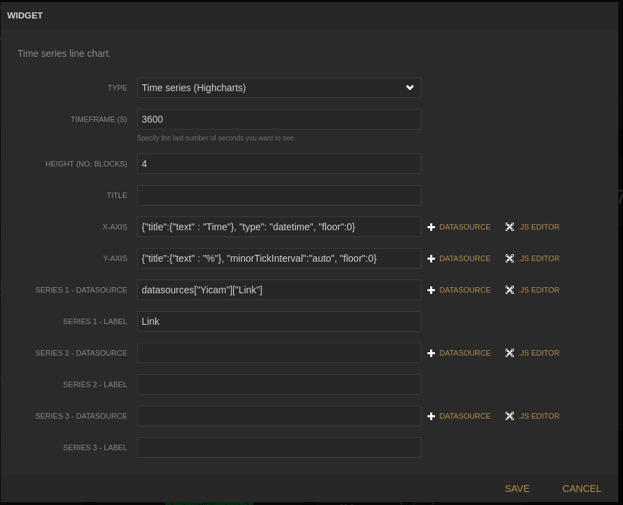

# freeboard-dynamic-highcharts-plugin
<h2>Dynamic highcharts widget plugin for <a href="https://github.com/Freeboard/freeboard" target="_blank">freeboard.io</a></h2>
<h2>A damn-sexy, open source real-time dashboard builder for IOT and other web mashups.</h2>

This widget plugin is highly based on the interactive-indicator created by <a href="https://github.com/hugocore/freeboard.io-plugins" target="_blank">Hugo Sequeira</a>.

Github repository: <a href="https://github.com/onlinux/freeboard-dynamic-highcharts-plugin" target="_blank">https://github.com/onlinux/freeboard-dynamic-highcharts-plugin</a>

<h2>See it in action @ <a href="https://goo.gl/hbAXXU" target="_blank">https://goo.gl/hbAXXU</a></h2>
<h1>INSTALLATION</h1>

Copy the file (plugin_highcharts.js from <a href="https://github.com/onlinux/freeboard-dynamic-highcharts-plugin" target="_blank">https://github.com/onlinux/freeboard-dynamic-highcharts-plugin</a>) to your freeboard installation, for example:

<pre style="color: #333333;"><code>$ cp ./plugin_highcharts.js /freeboard/plugins/thirdparty
</code></pre>

edit the <a style="color: #4078c0;" href="https://github.com/Freeboard/freeboard/blob/master/index.html#L14" target="_blank">freeboard index.html file</a> and add a link to the plugin near the end of the head.js script loader, like:

<pre style="color: #333333;"><code>head.js(
  'js/freeboard_plugins.min.js',
  'plugins/actuator.js',
  $(function() {
    //DOM Ready
    freeboard.initialize(true);
  })head.js(
 'js/freeboard_plugins.min.js',
 'plugins/thirdparty/plugin_highcharts.js',
 $(function() {
 //DOM Ready
 freeboard.initialize(true);
 })</code></pre>
